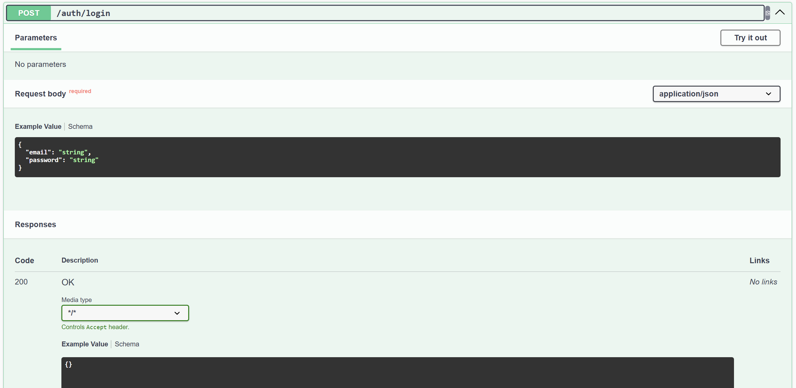
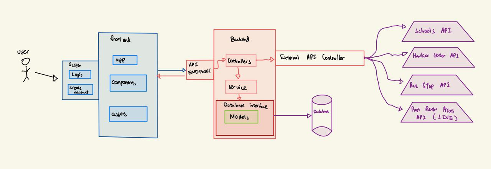

# SC2006 SDAD Group 6 Project

***
[HomeGoWhere Demo Video](https://youtu.be/TmECs9crvUk)

## Table of Contents
- [HomeGoWhere](#overview)
- [Setup Instructions](#setupInstr)
  - [Frontend](#frontendSetup)
  - [Backend](#backendSetup)
    - [Database Configuration](#database-configuration)
- [Pre-Configured Users](#preConfigured)
- [Documentation](#documentation)
- [API Docs](#apiDocs)
- [App Design](#appDesign)
  - [Overview](#appOverview)
  - [Frontend](#frontend)
  - [Backend](#backend)
  - [Design Patterns](#designPatterns)
  - [SOLID Principles](#solidPrinciples)
  - [Tech Stack](#techStack)
- [External APIs](#externalAPI)
- [Contributors](#contributors)

***

## <a id='overview'>HomeGoWhere</a>

***

- This application serves the purpose of helping Owners to rent houses and Tenants to find rooms to rent.

## <a id='setupInstr'>Setup Instructions</a>

***

### <a id='frontendSetup'>Frontend Setup</a>
1. In the `/frontend` directory, install the required node modules.
```
npm install
``` 
2. Start the application
```
npm run start
```
Now you are ready to start using the HomeGoWhere frontend! The frontend application is running on [http://localhost:TBC](https://localhost:XXX/)

### <a id='backendSetup'>Backend Setup</a>
1. cd into /HomeGoWhere
```angular2html
cd .\HomeGoWhere\
```
2. run backend
```angular2html
mvn spring-boot:run
```
Now you are ready to start using the HomeGoWhere Application backend. The server application is running on [http://TBC](http://TBC).

#### <a id='database-configuration'>Database Configuration</a>
1. Done using postgresql, with relational database.

## <a id='preConfigured'>Pre-Configured Users</a>
| UserID | Name         | Email                     | Contact  | Photo | Password (Hashed) | 
|--------|--------------|---------------------------|----------|-----|--- |
|27	| Peter Parker | peter.parker123@gmail.com | 88888883 | NULL	 |\$2a\$10\$J4zzLG8OLo.f87Cw5oiGEeQ9TIi6zC4gkU3FI3Y6nUknuNGu7kI9a|
|28	| Tony Stark   | tony.stark999@gmail.com   | 88888884 | NULL	 |\$2a\$10\$9vErzEkUj/fbBE/8WPtzwO4UdMRKVeN87kEDdQ4O.uoTwMjUmd9QK|
|29	| Bruce Banner | bruce.banner101@gmail.com | 88888885 | NULL	 |\$2a\$10\$/WfMrfSj.IBP5lC1jSJ1gegyuFilLGQyN.s.HfVMiYU51wQJzD/CK|
|30	| Diana Prince | diana.prince88@gmail.com  | 88888886 | NULL	 |\$2a\$10\$Q1Xld6glaQqPTIgSoxfBhOmTkK2hcsZeZjGtGHu/FCKMQe4zSz5De|
|31	| Barry Allen  | barry.allen33@gmail.com   | 88888887 | NULL	 |\$2a\$10\$4gxTBRZWEKVV9vXVovZGl.xLHtRjBYPh8Ctfoojh/5OGiIG7WcY3W|
|32	| Clark Kent   | clark.kent456@gmail.com   | 88888888 | NULL	 |\$2a\$10\$4sfzFEeDAOyNkbsh5KUhmum3.fZMgQBpZ4ThzxHIt2/6PHSpl2zsq|

## <a id='documentation'>Documentation</a>

## <a id='apiDocs'>API Docs</a>
HomeGoWhere backend application uses Spring-Boot.

This is an example of one of the many API end points we have


Our api documentation is in http://localhost:8080/swagger-ui/index.html#/ after running backend
***

## <a id='appDesign'>App Design</a>

***

### <a id='appOverview'>Overview</a>


***

### <a id='frontend'>Frontend</a>
The HomeGoWhere project is a mobile application built with React Native and Expo for the frontend and utilizes Axios for making HTTP requests to the backend API. This document provides an overview of the folder structure and the purpose of each key file and directory.

#### `HomeGoWhere`
- Main project directory where all the application code and dependencies are located.

#### `.expo`
- Contains configuration files specific to the **Expo** environment. These files are generally managed by **Expo** and handle settings for running the app on different devices, enabling hot reloading, and other Expo-specific features.

#### `app`
- Primary source folder for the application's components and screens.
- Stores main UI components and core logic that make up the app.

#### `assets`
- Holds static resources such as images, fonts, icons, and other media files used throughout the app.

#### `components`
- Contains reusable **React Native** components that are shared across various screens and features within the app.
- Encourages modularity by allowing different parts of the app to utilize these components without duplicating code.

#### `node_modules`
- Stores all installed dependencies for the project. When `npm install` or `yarn install` is run, all required libraries, including **React Native**, **Expo**, **Axios**, and others, are saved here.
- **Note**: This folder should not be modified directly, as it is managed by the package manager.

### Key Files

#### `.gitignore`
- Specifies which files and directories Git should ignore when committing changes to the repository.
- Includes entries such as `node_modules`, logs, and build artifacts that are not necessary to track in version control.

#### `app.json`
- Core configuration file for the **Expo** app.
- Defines settings like the app name, version, icon, splash screen, and other metadata. Expo uses this file to understand how to package and serve the app.

#### `babel.config.js`
- Configuration file for **Babel**, a JavaScript compiler that enables the use of modern JavaScript features.
- Transforms the code to ensure compatibility with the various environments in which the app may run.

#### `expo-env.d.ts`
- TypeScript declaration file for **Expo**.
- Provides typings for Expo-specific modules and custom environment variables used within the app, enhancing type safety and code completion.

#### `package.json`
- Lists the project's dependencies and scripts.
- Stores metadata about the project, such as its name, version, and a list of npm/yarn dependencies, including **React Native**, **Expo**, and **Axios**.
- Contains scripts for running, building, and testing the application, e.g., `npm start` to run the app in development mode.

#### `package-lock.json`
- Automatically generated file that locks the versions of all dependencies used in the project.
- Ensures consistent installation of the exact same dependency versions on different devices or environments.

#### `tsconfig.json`
- TypeScript configuration file that defines compiler options, such as the target version of JavaScript, module system, and directory paths.
- Ensures TypeScript checks and compiles code according to the project's specific requirements, improving type safety and error checking.
***

### <a id='backend'>Backend</a>
#### `\HomeGoWhere\src\main\java\HomeGoWhere`
- Contains all the folders for the backend

#### `\HomeGoWhere\src\main\java\HomeGoWhere\service`
- Contains methods to create, read, update, and delete business objects.

#### `\HomeGoWhere\src\main\java\HomeGoWhere\model`
- Contains the Business Objects.

#### `\HomeGoWhere\src\main\java\HomeGoWhere\controller`
- Controllers that uses the various services implemented in the `\service` directory.

#### `\HomeGoWhere\src\main\java\HomeGoWhere\dto`
- contains all the Data Transferable Objects

#### `\HomeGoWhere\src\main\java\HomeGoWhere\repository`
- Contains all the interface of the service for service to implement
- Contains all the specific queries for the database that is not provided by Spring-boot

#### `\HomeGoWhere\src\main\java\HomeGoWhere\security`
- Contains all security features of our Application, such as JWT authentication

#### `\HomeGoWhere\src\test\java\HomeGoWhere\HomeGoWhere`
- Contains all the API Endpoint unit testing to ensure the API Endpoints are working as intended
***

### <a id='designPatterns'>Design Patterns</a>
1. `Facade Pattern` via the `Controllers`.
   1. Refer to `\HomeGoWhere\src\main\java\HomeGoWhere\controller`
   2.  The goal is to simplify the interactions with various subsystems, thereby enhancing usability and maintainability.


***

### <a id='solidPrinciples'>SOLID Principles</a>
1. Single Responsibility Principle
   1. Different packages with different distinct responsibilities are created. Specific classes in each package are responsible for a specific business model or logic group.
2. Open-Closed Principle
   1. The application is open to extension through the use of facade pattern (controllers).
3. Interface Segregation Principle
   1. Small and specific interfaces are used
4. Dependency Injection Principle
   1. Spring boot application has appropriate annotations such as @Service and @Autowired to mark the classes where dependencies need to be injected

***

### <a id='techStack'>Tech Stack</a>

***

#### Frontend:

***

- React Native
- JavaScript
- Expo

#### Backend:

***

- SpringBoot
- Java
- PostgresSQL

## <a id='externalAPI'>External APIs</a>
### Schools
- [Schools API](https://data.gov.sg/api/action/datastore_search?resource_id=d_688b934f82c1059ed0a6993d2a829089)
### Hawker Centre
- [Hawker Center API](https://data.gov.sg/api/action/datastore_search?resource_id=d_68a42f09f350881996d83f9cd73ab02f)
### Bus Stop (Require API KEY)
- [Bus Stop API](https://datamall2.mytransport.sg/ltaodataservice/BusStops)
### Past Rental Prices (Require API KEY) [Live]
- [Daily API KEY update](https://www.ura.gov.sg/uraDataService/insertNewToken.action)
- [Rental Prices API](https://www.ura.gov.sg/uraDataService/invokeUraDS?service=PMI_Resi_Rental&refPeriod=14q1)


***

To be filled.

## <a id='contributors'>Contributors</a>

***

> The following contributors have contributed to the whole Software Developement Life-cycle, including (not exhausive):
> 1. Ideation and refinement 
> 2. Generation of functional and non-funtional requirements 
> 3. Generation of Use Cases and Descriptions
> 4. UI/UX Mockup and Prototyping (Figma)
> 5. Design of Architecture Diagram, Class Diagram, Sequence Diagrams, and Dialog Map Diagram
> 6. Development of Application
> 7. Black-box and White-box Testing
> 8. Documentations

| Name | Github Username                                         | Role             |
| --- |---------------------------------------------------------|------------------|
| Lim Jing Rong | [jingronggg](https://github.com/JingRonggg)             | Backend/Frontend |
| Loo Ping Wee | [lpwee](https://github.com/lpwee)                       |Backend/Frontend                  | 
| Goh Shuen Wei | [shuenwei](https://github.com/shuenwei)                 |Backend/Frontend                  |
| Ng Jing En | [negnij](https://github.com/negnij)                     |Backend/Frontend                  |
| Babu Sankar Nithin Sankar | [nithinsankar-b](https://github.com/nithinsankar-b)     |Backend/Frontend                  |
| Lau Zhan You | [donkey-king-kong](https://github.com/donkey-king-kong) |Backend/Frontend                  |